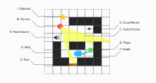
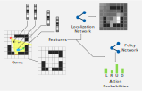

# Pursuer Design Doc

This document provides details for "Pursuer", an interactive demo illustrating how deep learning can be used to create
smarter enemies in video games. As a game like this heavily hinges on the strength of its AI, both are given equal
weight.

## Motivation

The Terminator from *The Terminator*. The Predator from *Predator*. The alien from *Alien*. Other than the obvious,
these characters have one thing in common: They're all famous examples of intelligent hunters. They collect information
about their target, then corner them so there's no where left to go.

Game designers have figured out how to take this stressful feeling of being hunted and make it fun, through the use of
pursuer enemies. [Mr. X](https://residentevil.fandom.com/wiki/T-00) in Resident Evil 2 is a slow but persistent enemy
that roams the halls of the police station, looking for the player. The [SA-X](https://metroid.fandom.com/wiki/SA-X) in
Metroid Fusion is a copy of the player with all of their abilities that they have no choice but to run from during
encounters. And [the Alien](https://alienisolation.fandom.com/wiki/Alien) from Alien: Isolation can sprint towards the
player at breakneck speeds as soon as they've confirmed their location.

The goal of this project is to create a short game with a pursuer type enemy using deep learning. This involves both
[localization](https://en.wikipedia.org/wiki/Robot_navigation) of the target from the agent's observations, and
[learning a policy](https://en.wikipedia.org/wiki/Reinforcement_learning) that balances information collection with
other concerns to maximize its chances of eliminating the player. The hope is that by using machine learning, designers
only have to worry about *what* observations agents have access to, and not *how* to turn those observations into a
successful hunting strategy.

## Game Details

We'll start by creating a top-down 2D prototype. The following diagram contains an overview of all entities present in
the game.

Entities A and B in the diagram are the Pursuer and the Player, respectively. The Pursuer uses what it sees within its
field of vision (denoted as C) to predict where the Player is and corner it. If the Player is within the Pursuer's
firing range, the game ends. The Player has to hide from the Pursuer while completing objectives (I), which consist of
just touching the objective markers.

The Player can take advantage of the environment to prevent getting caught. Walls (H) are static, unmovable objects that
block the Pursuer's field of vision. Doors (G) are like walls, except they can be opened by either the Pursuer or
Player. Noise sources (D) trigger when the Player is near them, alerting the Pursuer if it is also in range. Visual
markers (E) change state when the player is near them, alerting the Pursuer if it later takes a look at the marker.
Puddles (F) cause the player to leave a trail, providing evidence that the player was there.

In the full demo, these environmental objects can be used as building blocks for real in-game objects. For example, a
fallen vase that shatters when it hits the ground is both a noise source, alerting the Pursuer to the Player's location,
and a visual marker, indicating that someone was there.

## AI Details

Let's now talk about the AI that'll drive the Pursuer. The following diagram shows a high level overview of how the
agent converts observations into actions.

An intelligent hunter uses environmental cues to track down its prey, allowing it to ambush it when it least expects it.
In the same way, on every frame, the AI combines its current observations with its previous estimate of the target's
location. This is a bit like the reverse of the localization problem -- instead of using observations to infer its own
position, it uses its observations to infer *someone else's* position.

Since localization is a pretty common problem, we can use prior art instead of coming up with something novel. Two
approaches that look promising are [Deep Kalman Filters](https://arxiv.org/abs/1511.05121) and [Differentiable Particle
Filters](https://arxiv.org/abs/1805.11122), which are deep learning variants of classic localization algorithms. As a
naive baseline, we can also pass our current evidence along with our prior predictions to a neural neural network and
use softmax loss to predict where the target is.

Aside from playing detective, the AI also has to use its estimate of the target's location to trap and corner it. This
requires learning a policy, which we'll do with reinforcement learning. More specifically, I'd like to use PPO, since
our environment should be pretty fast and I've historically gotten better results with it.

We'd like our AI to perform well even against the best player strategies, while being robust against a variety of play
styles. We will use [self play](https://en.wikipedia.org/wiki/Self-play) to accomplish this. We'll start out with an
active Pursuer agent and an active Player agent. The Pursuer will be rewarded whenever it catches the Player, while the
Player will be penalized for being caught. After a period of time, the active Player network will be saved to a buffer,
and this saved policy will be added as another opponent for the Pursuer to face off against. As training progresses, the
buffer of player agents will consist solely of the highest scoring agents, allowing the Pursuer to train against a
diverse set of opponents.